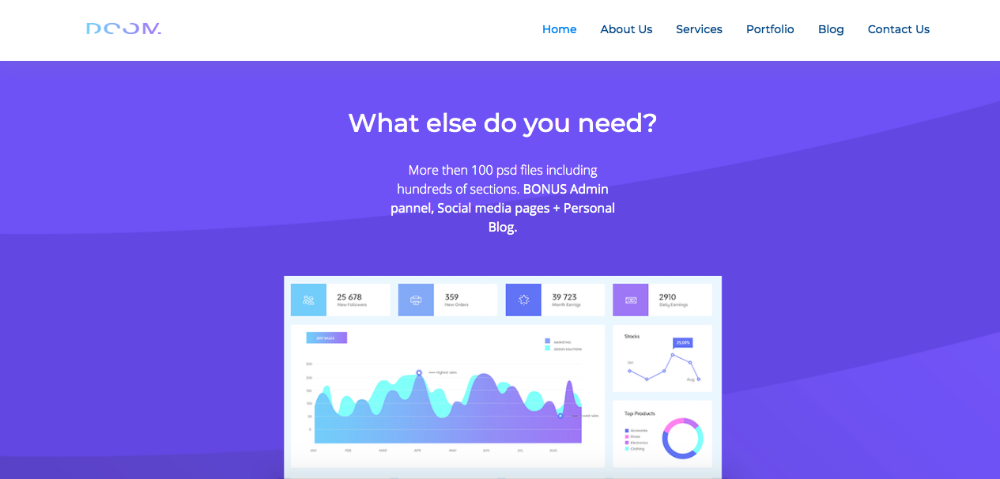
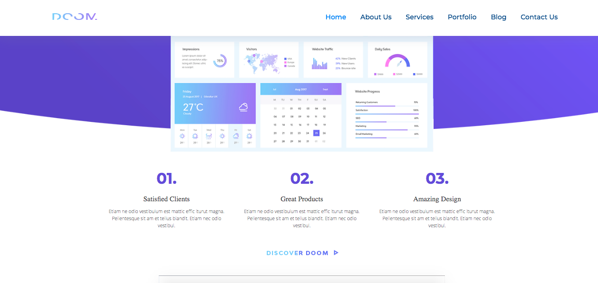
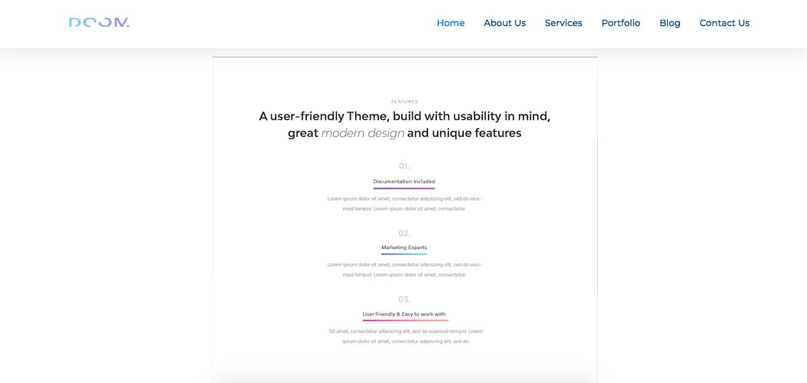
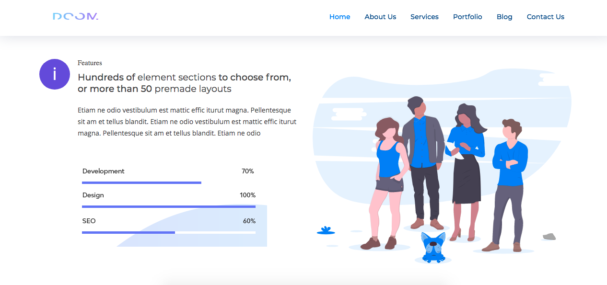
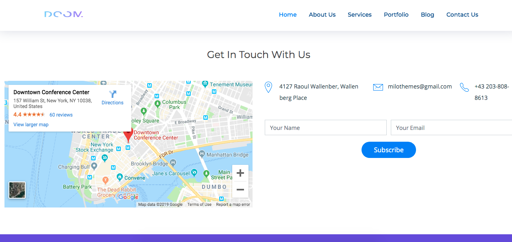
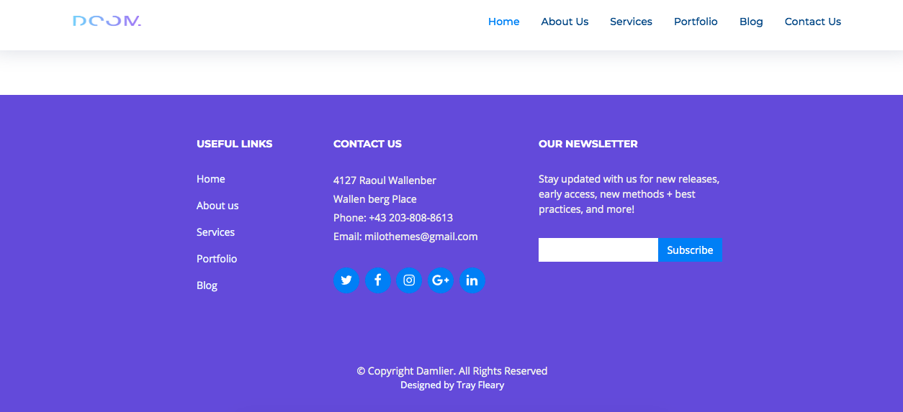

# StartupRocket 

Quick Frontend UI Build Concept from scratch, using mostly HTML, CSS, Bootstrap, some JS. Next Steps: Full build, multiple pages, a lot of JavaScript + dynamic UX/UI.

## Technologies Used:
____
* VS Code
* HTML, CSS, Bootstrap, some JavaScript

<!-- ## Live Deployed Project Link -->
<!-- ___ -->
<!-- [Heroku](https://startup-rocket.herokuapp.com/) -->

## Quick Site Glance :
____

